Text Mining - Middlemarch vs. Wuthering Heights
================
Mark Blackmore
January 30, 2018

### Total Words

``` r
# Middlemarch
nrow(tidy_middlemarch)
```

    ## [1] 320374

``` r
# Wuthering Heights
nrow(tidy_wuthering)
```

    ## [1] 117111

### Unique Words

``` r
# Middlemarch
(repo_count_middle <- tidy_middlemarch %>%
    summarise(keys = n_distinct(word)))
```

    ## # A tibble: 1 x 1
    ##    keys
    ##   <int>
    ## 1 15675

``` r
# Wuthering Heights
(repo_count_wuthering <- tidy_wuthering %>%
    summarise(keys = n_distinct(word)))
```

    ## # A tibble: 1 x 1
    ##    keys
    ##   <int>
    ## 1  9486

### Most common words, excluding stopwords (e.g. is, the, are,...)

    ## Joining, by = "word"
    ## Joining, by = "word"

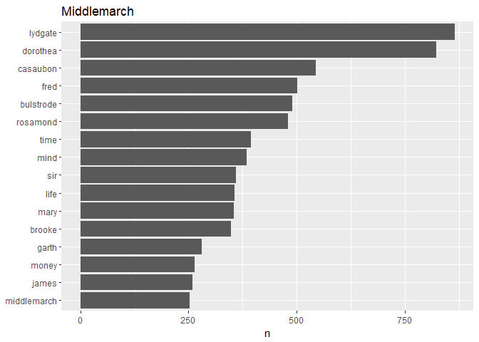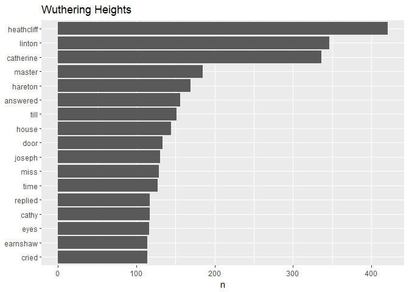

### Wordclouds

#### Middlemarch

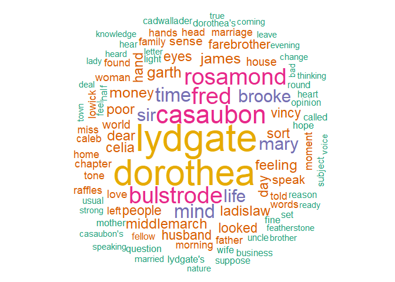

#### Wuthering Heights

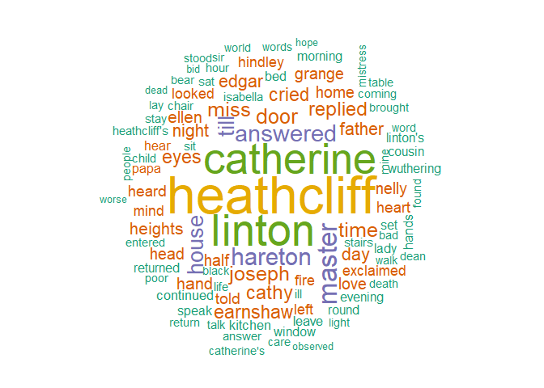

### Sentimnt: Positive Words minus Negative Words by Paragraph

    ## Joining, by = "word"

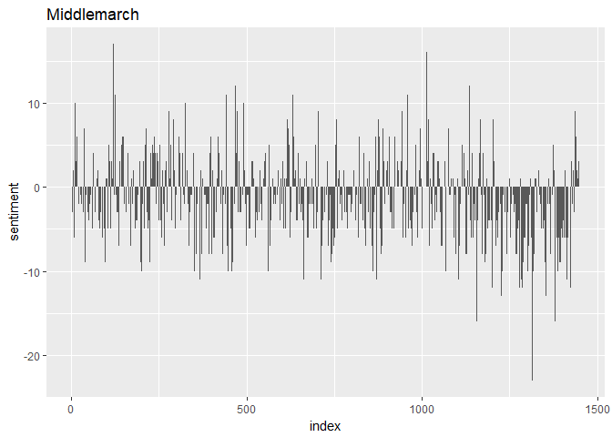

    ## Joining, by = "word"

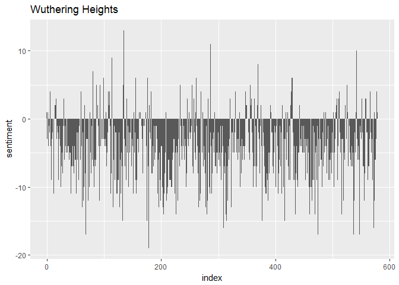

### Middlemarch n-grams

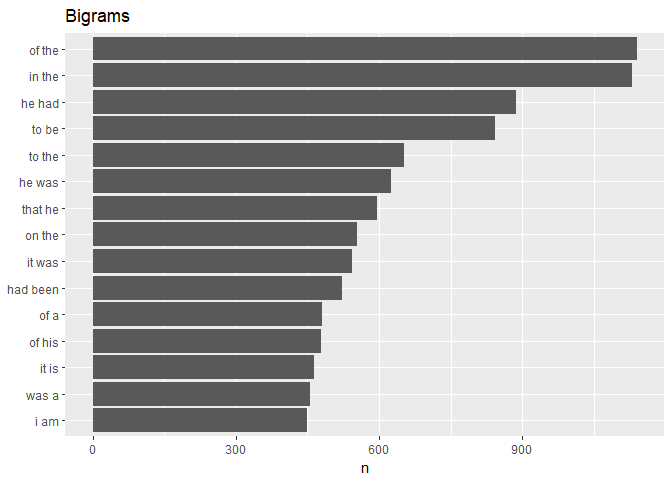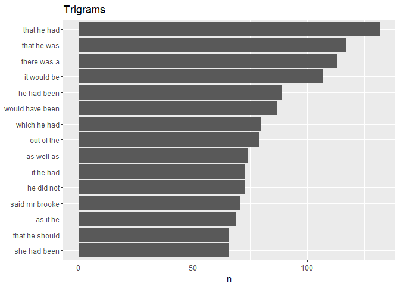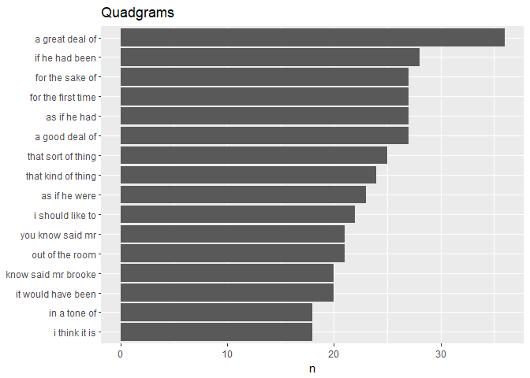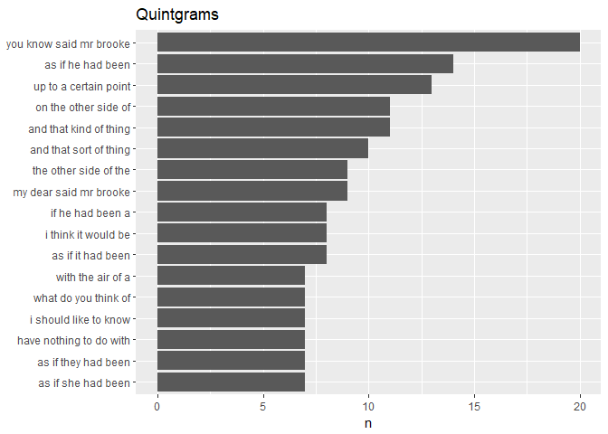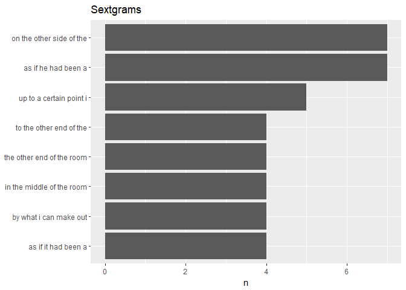
