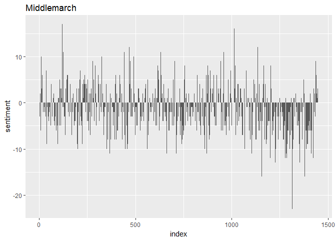
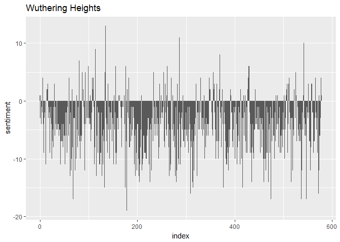
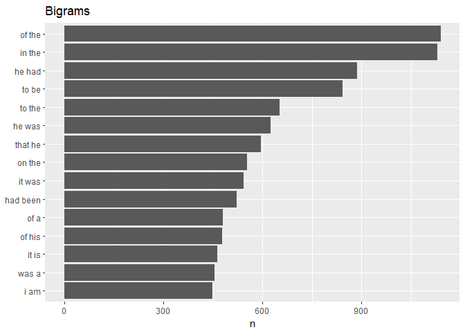
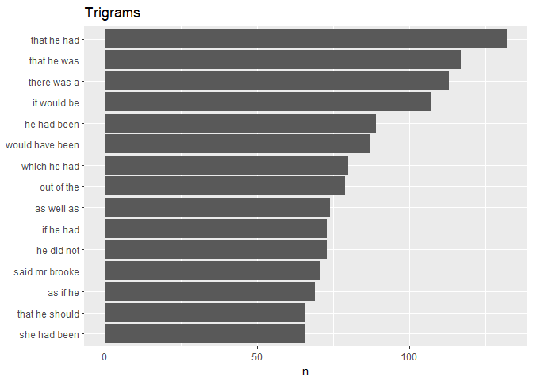
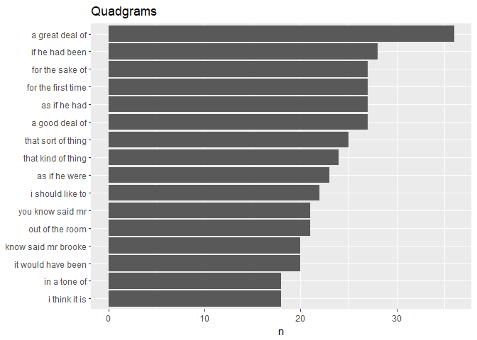
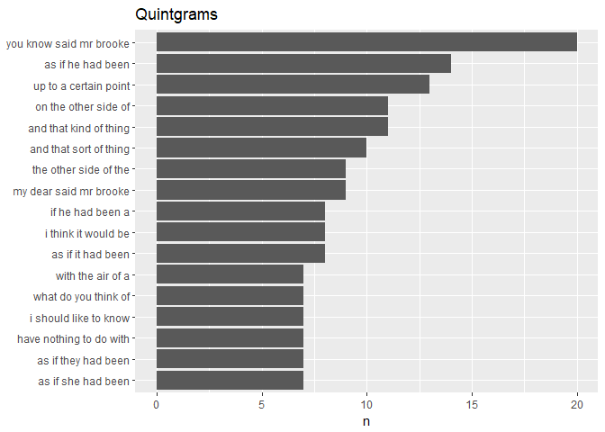
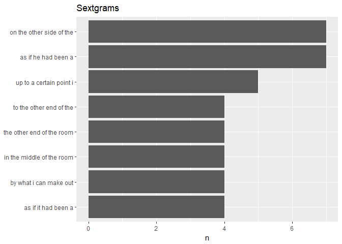

Text Mining - Middlemarch v. Wuthering Heights
================
Mark Blackmore
2018-01-30

-   [Download books from Project Gutenberg](#download-books-from-project-gutenberg)
-   [Tidy book text and remove stopwords](#tidy-book-text-and-remove-stopwords)
-   [Most common words, excluding stopwords (e.g. is, the, are,...)](#most-common-words-excluding-stopwords-e.g.-is-the-are...)
-   [Wordclouds](#wordclouds)
-   [Calculating & visualizing net sentiment](#calculating-visualizing-net-sentiment)
-   [Create all n-grams for Middlemarch](#create-all-n-grams-for-middlemarch)
    -   [Bigrams](#bigrams)
    -   [Trigrams](#trigrams)
    -   [Quadgrams](#quadgrams)
    -   [Sextgrams](#sextgrams)
-   [Display top n-grams](#display-top-n-grams)

``` r
suppressWarnings(
  suppressPackageStartupMessages({
    library(gutenbergr)
    library(stringr)
    library(tidyverse)
    library(tidytext)
    library(tidyr)
    library(wordcloud)
  })
)
```

### Download books from Project Gutenberg

``` r
id <- gutenberg_works(title %in% c("Middlemarch", "Wuthering Heights"))
middlemarch <- gutenberg_download(id[1,1])
```

    ## Determining mirror for Project Gutenberg from http://www.gutenberg.org/robot/harvest

    ## Using mirror http://aleph.gutenberg.org

``` r
wuthering_heights <- gutenberg_download(id[2,1])
```

### Tidy book text and remove stopwords

``` r
tidy_middlemarch <- middlemarch %>% 
  unnest_tokens(word, text)

tidy_wuthering <- wuthering_heights %>% 
  unnest_tokens(word, text)

# Total words
nrow(tidy_middlemarch)
```

    ## [1] 320374

``` r
nrow(tidy_wuthering)
```

    ## [1] 117111

``` r
# Unique words
(repo_count_middle <- tidy_middlemarch %>%
    summarise(keys = n_distinct(word)))
```

    ## # A tibble: 1 x 1
    ##    keys
    ##   <int>
    ## 1 15675

``` r
(repo_count_wuthering <- tidy_wuthering %>%
    summarise(keys = n_distinct(word)))
```

    ## # A tibble: 1 x 1
    ##    keys
    ##   <int>
    ## 1  9486

### Most common words, excluding stopwords (e.g. is, the, are,...)

``` r
# Remove stopwords  
clean_middlemarch <- tidy_middlemarch %>%
   anti_join(stop_words)
```

    ## Joining, by = "word"

``` r
clean_wuthering <- tidy_wuthering %>%
   anti_join(stop_words)
```

    ## Joining, by = "word"

``` r
# Middlemarch
clean_middlemarch %>%
  count(word, sort = TRUE) %>%
  filter(n > 250) %>%
  mutate(word = reorder(word, n)) %>%
  ggplot(aes(word,n)) +
  geom_col() +
  xlab(NULL) +
  coord_flip()
```


``` r
# Wuthering Heights
clean_wuthering %>%
  count(word, sort = TRUE) %>%
  filter(n > 110) %>%
  mutate(word = reorder(word, n)) %>%
  ggplot(aes(word,n)) +
  geom_col() +
  xlab(NULL) +
  coord_flip()
```


### Wordclouds

``` r
clean_middlemarch %>% 
  count(word, sort = TRUE) %>%
  with(wordcloud(word, n, max.words = 50, 
               colors = brewer.pal(6, 'Dark2'), random.order = FALSE))
```


``` r
clean_wuthering %>%
  count(word, sort = TRUE) %>%
  with(wordcloud(word, n, max.words = 50, 
                 colors = brewer.pal(6, 'Dark2'), random.order = FALSE))
```


### Calculating & visualizing net sentiment

``` r
clean_middlemarch <- clean_middlemarch %>%
  mutate(linenumber = row_number())

clean_middlemarch %>%
  inner_join(get_sentiments("bing")) %>%
  count(index = linenumber %/% 70, sentiment) %>%
  # Spread sentiment and n across multiple columns
  spread(sentiment, n, fill = 0) %>%
  # Use mutate to find net sentiment
  mutate(sentiment = positive - negative) %>%
  # Put index on x-axis, sentiment on y-axis
  ggplot(aes(index, sentiment)) +
  # Make a bar chart with geom_col()
  geom_col()
```

    ## Joining, by = "word"



``` r
clean_wuthering <- clean_wuthering %>%
  mutate(linenumber = row_number())

clean_wuthering %>%
  inner_join(get_sentiments("bing")) %>%
  count(index = linenumber %/% 70, sentiment) %>%
  # Spread sentiment and n across multiple columns
  spread(sentiment, n, fill = 0) %>%
  # Use mutate to find net sentiment
  mutate(sentiment = positive - negative) %>%
  # Put index on x-axis, sentiment on y-axis
  ggplot(aes(index, sentiment)) +
  # Make a bar chart with geom_col()
  geom_col()
```

    ## Joining, by = "word"



Create all n-grams for Middlemarch
----------------------------------

### Bigrams

``` r
bigram_middlemarch <- middlemarch  %>%
  unnest_tokens(bigram, text, token = "ngrams", n = 2)
```

### Trigrams

``` r
trigram_middlemarch <- middlemarch  %>%
  unnest_tokens(trigram, text, token = "ngrams", n = 3)
```

### Quadgrams

``` r
quadgram_middlemarch <- middlemarch  %>%
  unnest_tokens(quadgram, text, token = "ngrams", n = 4)
```

\#\#\# Quintgrams

``` r
quintgram_middlemarch <- middlemarch  %>%
  unnest_tokens(quintgram, text, token = "ngrams", n = 5)
```

### Sextgrams

``` r
sextgram_middlemarch <- middlemarch  %>%
  unnest_tokens(sextgram, text, token = "ngrams", n = 6)
```

Display top n-grams
-------------------

Bigrams

``` r
bigram_middlemarch %>%
  count(bigram) %>%
  top_n(15, n) %>%
  mutate(bigram = reorder(bigram, n)) %>%
  ggplot(aes(bigram, n)) +
  geom_col() +
  xlab(NULL) +
  coord_flip() +
  ggtitle("Bigrams")
```



Trigrams

``` r
trigram_middlemarch %>%
  count(trigram) %>%
  top_n(15, n) %>%
  mutate(trigram = reorder(trigram, n)) %>%
  ggplot(aes(trigram, n)) +
  geom_col() +
  xlab(NULL) +
  coord_flip() +
  ggtitle("Trigrams")
```



Quadgrams

``` r
quadgram_middlemarch %>%
  count(quadgram) %>%
  top_n(15, n) %>%
  mutate(quadgram = reorder(quadgram, n)) %>%
  ggplot(aes(quadgram, n)) +
  geom_col() +
  xlab(NULL) +
  coord_flip() +
  ggtitle("Quadgrams")
```



Quintgrams

``` r
quintgram_middlemarch %>%
  count(quintgram) %>%
  top_n(15, n) %>%
  mutate(quintgram = reorder(quintgram, n)) %>%
  ggplot(aes(quintgram, n)) +
  geom_col() +
  xlab(NULL) +
  coord_flip() +
  ggtitle("Quintgrams")
```



Sextgrams

``` r
sextgram_middlemarch %>%
  count(sextgram) %>%
  top_n(15, n) %>%
  mutate(sextgram = reorder(sextgram, n)) %>%
  ggplot(aes(sextgram, n)) +
  geom_col() +
  xlab(NULL) +
  coord_flip() +
  ggtitle("Sextgrams")
```


