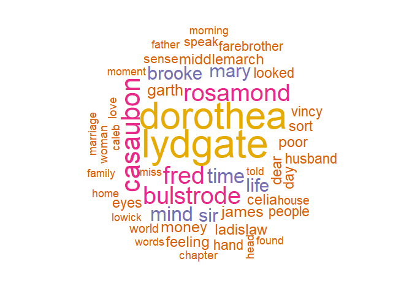

Text Mining - Middlemarch v. Wuthering Heights
================
Mark Blackmore
2018-01-29

-   [Download books from Project Gutenberg: Middlemarch & Wuthering Heights](#download-books-from-project-gutenberg-middlemarch-wuthering-heights)
-   [Tidy book text and remove stopwords](#tidy-book-text-and-remove-stopwords)
-   [Most common words](#most-common-words)
-   [Calculating & visualizing net sentiment](#calculating-visualizing-net-sentiment)

``` r
suppressWarnings(
  suppressPackageStartupMessages({
    library(gutenbergr)
    library(tidyverse)
    library(tidytext)
    library(tidyr)
    library(stringr)
  })
)
```

### Download books from Project Gutenberg: Middlemarch & Wuthering Heights

``` r
id <- gutenberg_works(title %in% c("Middlemarch", "Wuthering Heights"))
middlemarch <- gutenberg_download(id[1,1])
```

    ## Determining mirror for Project Gutenberg from http://www.gutenberg.org/robot/harvest

    ## Using mirror http://aleph.gutenberg.org

``` r
wuthering_heights <- gutenberg_download(id[2,1])
```

### Tidy book text and remove stopwords

``` r
tidy_middlemarch <- middlemarch %>% 
  unnest_tokens(word, text)
tidy_middlemarch
```

    ## # A tibble: 320,374 x 2
    ##    gutenberg_id        word
    ##           <int>       <chr>
    ##  1          145 middlemarch
    ##  2          145          by
    ##  3          145      george
    ##  4          145       eliot
    ##  5          145         new
    ##  6          145        york
    ##  7          145         and
    ##  8          145      boston
    ##  9          145           h
    ## 10          145           m
    ## # ... with 320,364 more rows

``` r
tidy_wuthering <- wuthering_heights %>% 
  unnest_tokens(word, text)
tidy_wuthering
```

    ## # A tibble: 117,111 x 2
    ##    gutenberg_id      word
    ##           <int>     <chr>
    ##  1          768 wuthering
    ##  2          768   heights
    ##  3          768   chapter
    ##  4          768         i
    ##  5          768      1801
    ##  6          768         i
    ##  7          768      have
    ##  8          768      just
    ##  9          768  returned
    ## 10          768      from
    ## # ... with 117,101 more rows

``` r
# Remove stopwords  
tidy_middlemarch <- tidy_middlemarch %>%
  anti_join(stop_words)
```

    ## Joining, by = "word"

``` r
tidy_wuthering <- tidy_wuthering %>%
  anti_join(stop_words)
```

    ## Joining, by = "word"

### Most common words

``` r
# Middlemarch
tidy_middlemarch %>%
  count(word, sort = TRUE) %>%
  filter(n > 250) %>%
  mutate(word = reorder(word, n)) %>%
  ggplot(aes(word,n)) +
  geom_col() +
  xlab(NULL) +
  coord_flip()
```


``` r
# Wuthering Heights
tidy_wuthering %>%
  count(word, sort = TRUE) %>%
  filter(n > 110) %>%
  mutate(word = reorder(word, n)) %>%
  ggplot(aes(word,n)) +
  geom_col() +
  xlab(NULL) +
  coord_flip()
```


### Calculating & visualizing net sentiment

``` r
tidy_middlemarch <- tidy_middlemarch %>%
  mutate(linenumber = row_number())

tidy_middlemarch %>%
  inner_join(get_sentiments("bing")) %>%
  count(index = linenumber %/% 70, sentiment) %>%
  # Spread sentiment and n across multiple columns
  spread(sentiment, n, fill = 0) %>%
  # Use mutate to find net sentiment
  mutate(sentiment = positive - negative) %>%
  # Put index on x-axis, sentiment on y-axis
  ggplot(aes(index, sentiment)) +
  # Make a bar chart with geom_col()
  geom_col()
```

    ## Joining, by = "word"



``` r
tidy_wuthering <- tidy_wuthering %>%
  mutate(linenumber = row_number())

tidy_wuthering %>%
  inner_join(get_sentiments("bing")) %>%
  count(index = linenumber %/% 70, sentiment) %>%
  # Spread sentiment and n across multiple columns
  spread(sentiment, n, fill = 0) %>%
  # Use mutate to find net sentiment
  mutate(sentiment = positive - negative) %>%
  # Put index on x-axis, sentiment on y-axis
  ggplot(aes(index, sentiment)) +
  # Make a bar chart with geom_col()
  geom_col()
```

    ## Joining, by = "word"


